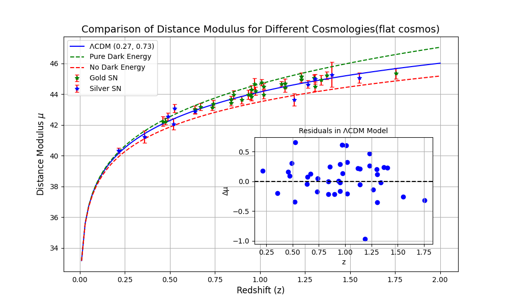
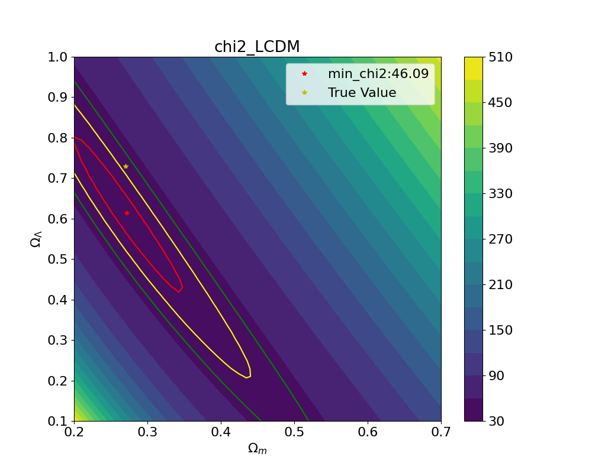

# 天体物理第三次程序作业

### 题目要求

1. Make a distance-redshift plot by collecting data from relevant sources in [ArXiv](https://arxiv.org/pdf/astro-ph/0611572.pdf)。
2. Plot the relation for a few different cosmologies and compare
3. Perform a fitting by minimizing the residual chi2. Plot contours of constant chi2 to explore parameter correlation/degeneracy
4. Extend to model with varying w(a)=w0+wa*a
5. Reproduce some other plots

## 1. Distance-redshift scatter plot

论文将观测到的 SN 数据集根据 confidence 分为 GOLD, SILVER 等级别，在此，我们默认将其全部考虑在内。尝试过使用附表中的链接，但是无法打开？所以在此只使用了 arXiv 上的数据。

论文的表 6 中给出了观测星系的红移 $z$, 距离模数 $\mu$, 以及误差等参数, 我们借用了这些数据:

| SN     | z     | $\mu_{a0}$ | $\sigma_b$ | hostAV | $\Delta$ | sample |
|--------|-------|------------|------------|--------|----------|----------|
| 1997ff | 1.755 | 45.35      | 0.35       | 0.0    | —        | Gold     |
| 2002dc | 0.475 | 42.24      | 0.2        | 0.21   | 0.19     | Gold     |
| ...    | ...   | ...        | ...        | ...    | ...      | ...      |

光度距离的定义为 $d_L \equiv \left(\frac{\mathcal{L}}{4\pi \mathcal{F}}\right)^{1/2}$, $\mathcal{L}$ 为 luminosity, $\mathcal{F}$ 为 flux.

在这里，距离模量的定义为 $\mu_0 = m - M = 5 \log d_l + 25$ ($d_L$ in mpc), 于是我们有: $d_L = 10^{(\mu_0 - 25) / 5}$(mpc).

根据以上信息，我们绘制出了距离-红移图：


## 2. Different cosmologies

由 Friedmann 方程, $\Omega_m + \Omega_\Lambda + \Omega_r + \Omega_k = 1$. 此处，我们假设 $\Omega_r \ll 1$. 宇宙学中光度距离与红移和宇宙膨胀的关系为：

$$\frac{d_l(z)}{c(1+z)} = \int_t^{t_0} \frac{dt'}{a(t')} = \int_0^z \frac{dz'}{H(z')}$$


### 2.1. 考虑动力学模型 $H(z)^2 = H_0^2 (\Omega_M (1+z)^3 + \Omega_\Lambda)$

我们给出该模型下的距离-红移图:



### 2.2. 考虑论文所给的动力学模型

非常奇怪，我在论文中找到两个不同动力学模型。我们在此做两个模型的分析：

1. 在一个具有质量密度 $\Omega_M$ 和真空能量密度(即宇宙学常数) $\Omega_\Lambda$ 的弗里德曼-罗伯逊-沃尔克（FRW）宇宙学框架中，预期的亮度距离 $d_L$​ 为

   $$d_L = cH_0^{-1}(1+z) |\Omega_k|^{-1/2} \text{sinn} \{|\Omega_k|^{1/2} \times \int_0^z dz [(1+z)^2(1+\Omega_M z)-z(2+z)\Omega_\Lambda]^{-1/2}\}$$

   其中, $\Omega_k = 1 - \Omega_M - \Omega_\Lambda$, 在平坦宇宙下，可以直接忽略 $\Omega_k$的影响.同时,
```python
def sinn(x, omega_k):
    return np.sinh(x) if omega_k > 0 else np.sin(x)
```

3. $$H(z) = H_0 \sqrt{\Omega_m (1+z)^3 + (1-\Omega_m)\times \exp \left(3 \int_0^{z} \frac{1+w(z')}{1+z'} d z\right)}$$
   在此模型下,宇宙学仅由 $w(z),\Omega_M$ 控制.作讨论如下:
    - $w(z)=-1, H(z) = H_0\sqrt{\Omega_m(1+z')^3 + (1 - \Omega_m)}$
    - $w(z) = 0, H(z) = H_0\Omega_m(1+z')^{3/2}$

    我们对 $w(z)$ 进行了拓展:
    - $w(z) = const, H(z) = H_0 \sqrt{\Omega_m (1+z')^3 + (1-\Omega_m)\times  (1 + z')^{3(1 + w)}}$
    - 拓展模型: $w(a)=w_0+w_a a = w_0 + w_a \frac{1}{1 + z'}$

## 3. Fitting by minimizing the residual chi2

论文给出了卡方数值的计算公式: 

$$\chi^2(H_0, \Omega_M, w_i) = \sum_i \frac{(\mu_{p,i}(z_i; H_0, \Omega_M, w_i) - \mu_{0,i})^2}{\sigma_{\mu_{0,i}}^2 + \sigma_v^2}$$ 

其中 $\sigma_v$ 是由于特殊速度导致的超新星红移的离散度(转换为距离模数单位), $\sigma_{\mu_{0,i}}$ 是单个距离模数的不确定性, $w_i$ 是描述 $w(z)$ 的一组暗能量参数. 此处, 我们需要将 $\sigma_v$ 转换为距离模数的单位: 

$$\mu = 5 \log d_l + 25 \to \Delta \mu = \frac{5}{d_l \ln 10} \Delta d_l = \frac{5}{10^{(\mu_0 - 25) / 5} \ln 10} \frac{\sigma_v}{H_0}$$

在下述图片中，如果不加说明，contour 的线条由里到外，分别为 $1\sigma$(red), $2\sigma$(yellow), $3\sigma$(green).

### 3.1 考虑动力学模型 $H(z)^2 = H_0^2 (\Omega_M (1+z)^3 + \Omega_\Lambda)$

```python
def E_LCDM(z, Omega_m=Omega_m, Omega_Lambda=Omega_Lambda):
    return np.sqrt(Omega_m * (1 + z)**3 + Omega_Lambda)
omega_m_array = np.linspace(0.2, 0.7, 50); omega_l_array = np.linspace(0.1, 1, 50)
Omega_m, Omega_l = np.meshgrid(omega_m_array, omega_l_array)
chi2_LCDM = np.zeros_like(Omega_m)
for i, omega_m in enumerate(omega_m_array):
    for j, omega_l in enumerate(omega_l_array):
        mu_LCDM = np.array([mu(z, E_LCDM, omega_m, omega_l) for z in data["z"]])
        mu_residue = data["mua0"] - mu_LCDM
        chi2_LCDM[j, i] = np.sum(mu_residue ** 2 / (data["sigma_b"] ** 2 + data["Sigma_v_in_mu"] ** 2))
min_index = np.unravel_index(np.argmin(chi2_LCDM), chi2_LCDM.shape)
# confidence interval
chi2_min = np.min(chi2_LCDM); chi2_68 = 1; chi2_95 = 4; chi2_99 = 9 
```



### 3.2 论文模型

1. 考虑论文所给的 $\Omega_M, \Omega_\Lambda$ 模型，我们成功复现了论文中的结果。

    

2. 考虑论文所给的 $w(z)$ 模型, 当我们取 $w(z)$ 为常数的时候，我们成功复现了论文中的卡方虚线结果。但我没有进行进一步的计算以得到 $w(z)$ 的最佳拟合值。

    

    进一步的，我们考虑了 $w(z) = w_0 + w_a z / (1 + z)$ 的情况，准备复现论文中图 9 的 Weak Prior 结果. 在 $w_0$ 上，我们得到的结果和论文中相近，但在 $w_a$ 上，我们的结果和论文中有较大差异。

    

### 3.2 拓展模型 \(w(z) = w_0 + w_a a\)

我们在此处考虑 $w(z) = w_0 + w_a /(1+z)$ 的情况: 


## 参考文献
https://iopscience.iop.org/article/10.1086/383612/pdf

https://arxiv.org/pdf/astro-ph/0611572.pdf
